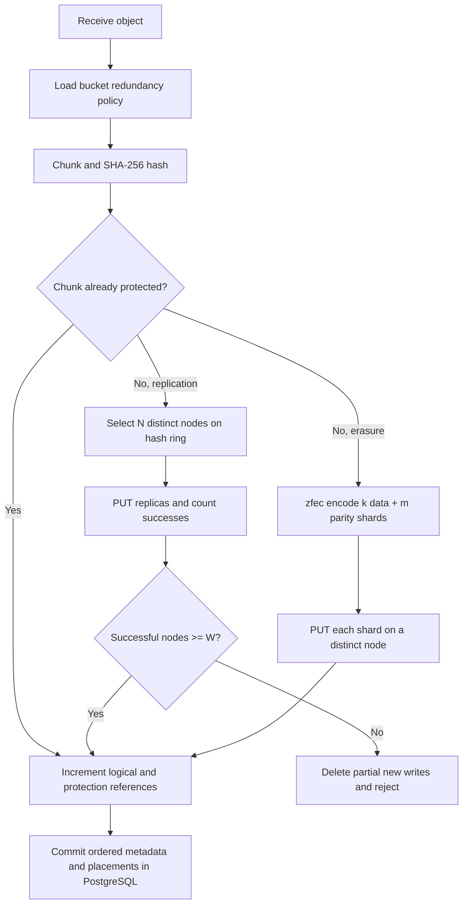
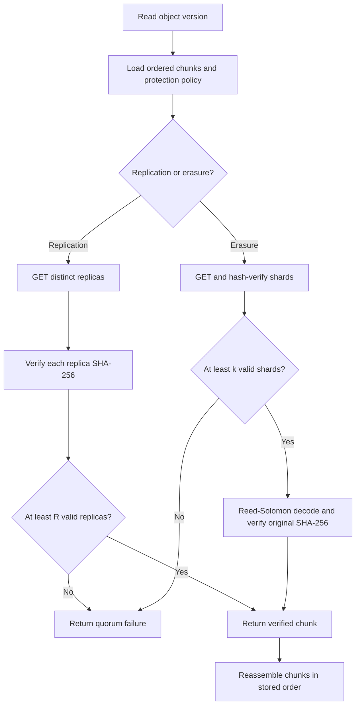
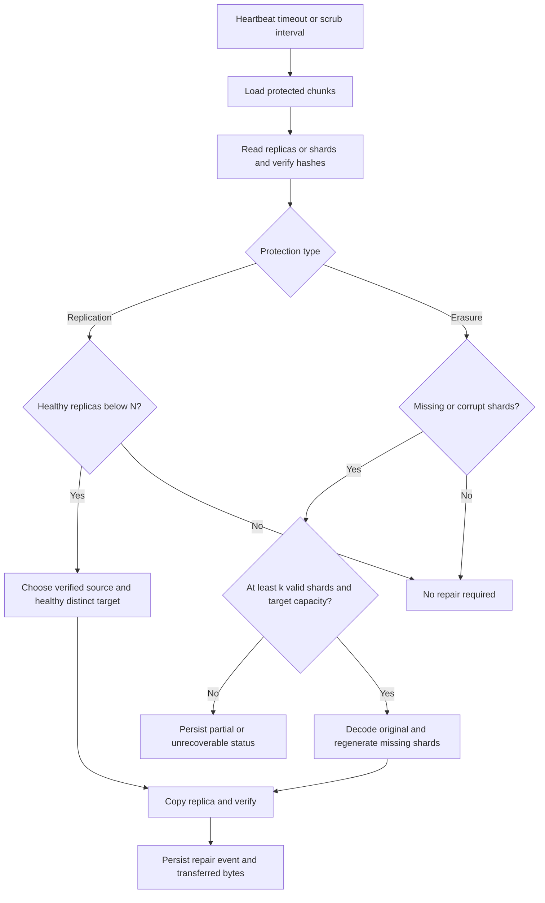

# Section 4 flowcharts

## Write path

```mermaid
flowchart TD
    A[Receive object] --> B[Load bucket redundancy policy]
    B --> C[Chunk and SHA-256 hash]
    C --> D{Chunk already protected?}
    D -- Yes --> I[Increment logical and protection references]
    D -- No, replication --> E[Select N distinct nodes on hash ring]
    E --> F[PUT replicas and count successes]
    F --> G{Successful nodes >= W?}
    G -- No --> H[Delete partial new writes and reject]
    G -- Yes --> I
    D -- No, erasure --> J[zfec encode k data + m parity shards]
    J --> K[PUT each shard on a distinct node]
    K --> I
    I --> L[Commit ordered metadata and placements in PostgreSQL]
```

## Read path

```mermaid
flowchart TD
    A[Read object version] --> B[Load ordered chunks and protection policy]
    B --> C{Replication or erasure?}
    C -- Replication --> D[GET distinct replicas]
    D --> E[Verify each replica SHA-256]
    E --> F{At least R valid replicas?}
    F -- No --> G[Return quorum failure]
    F -- Yes --> K[Return verified chunk]
    C -- Erasure --> H[GET and hash-verify shards]
    H --> I{At least k valid shards?}
    I -- No --> G
    I -- Yes --> J[Reed-Solomon decode and verify original SHA-256]
    J --> K
    K --> L[Reassemble chunks in stored order]
```

## Failure and repair path

```mermaid
flowchart TD
    A[Heartbeat timeout or scrub interval] --> B[Load protected chunks]
    B --> C[Read replicas or shards and verify hashes]
    C --> D{Protection type}
    D -- Replication --> E{Healthy replicas below N?}
    E -- Yes --> F[Choose verified source and healthy distinct target]
    F --> G[Copy replica and verify]
    D -- Erasure --> H{Missing or corrupt shards?}
    H -- Yes --> I{At least k valid shards and target capacity?}
    I -- No --> J[Persist partial or unrecoverable status]
    I -- Yes --> K[Decode original and regenerate missing shards]
    K --> G
    E -- No --> L[No repair required]
    H -- No --> L
    G --> M[Persist repair event and transferred bytes]
```

